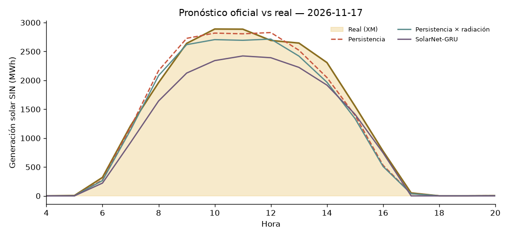

# ☀️ Liga de Pronóstico Solar Colombia — Leaderboard

_Actualizado: 2026-11-18 15:13 (hora Colombia) · Métrica: MAE en horas de sol (06–18 h) · Skill = 1 − MAE/MAE_persistencia (positivo = le ganas a la persistencia)_

## 🏆 Liga oficial (predicciones hechas ANTES de conocer el dato real)

| # | Modelo | Autor | Días | MAE (MWh) | nMAE | Skill vs persistencia |
|---|---|---|---|---|---|---|
| 🥇 | SolarNet-GRU | profe | 25 | 228.1 | 15.7% | +31.2% |
| 🥈 | Persistencia × radiación | profe | 25 | 257.1 | 17.7% | +30.9% |
| 🥉 | Persistencia | profe | 25 | 420.1 | 28.9% | — |

## 🧪 Backtest (días pasados, para arrancar en frío)

_Ojo: en el backtest el 'pronóstico' de clima es casi el clima observado → resultados optimistas._

_Aún no hay días calificados: XM publica con 1-2 días de rezago._
